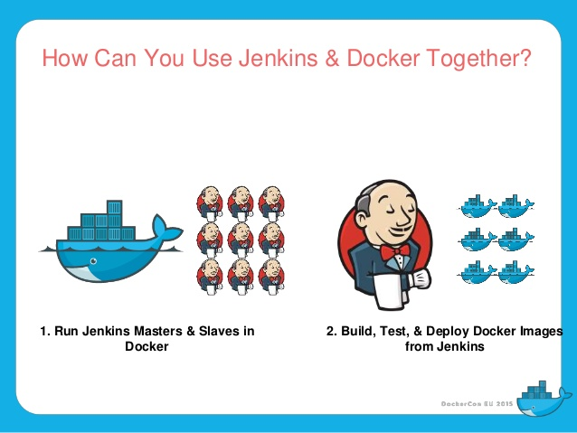
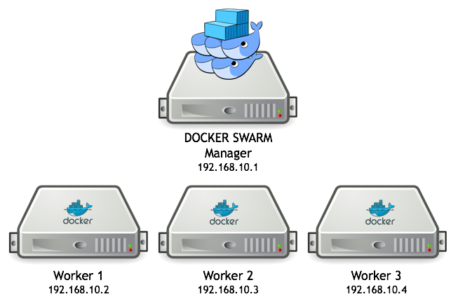
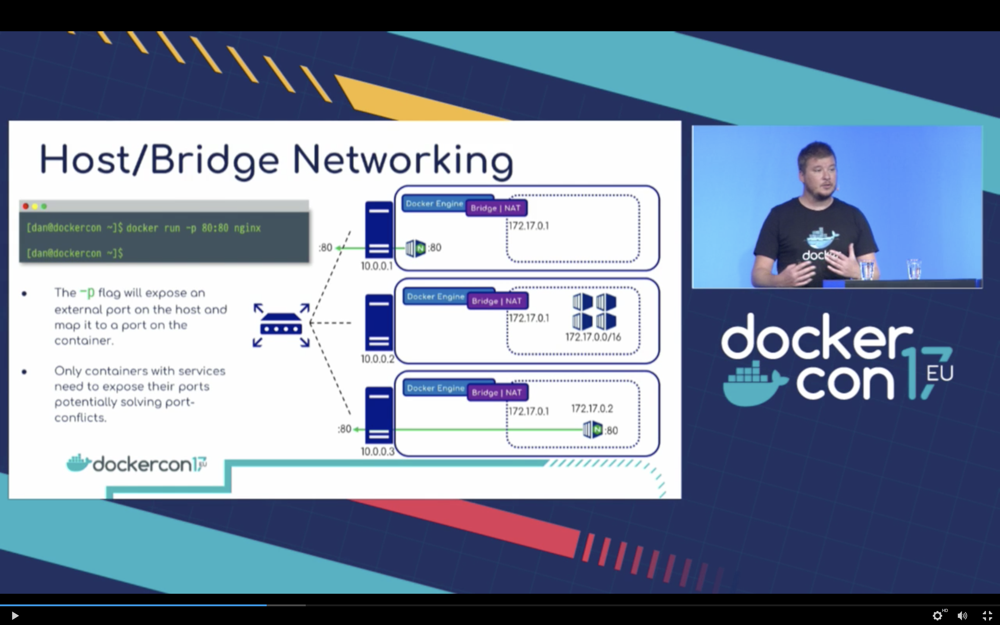
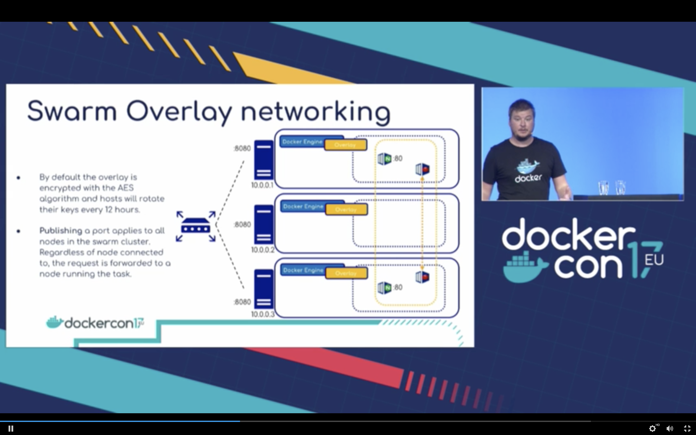
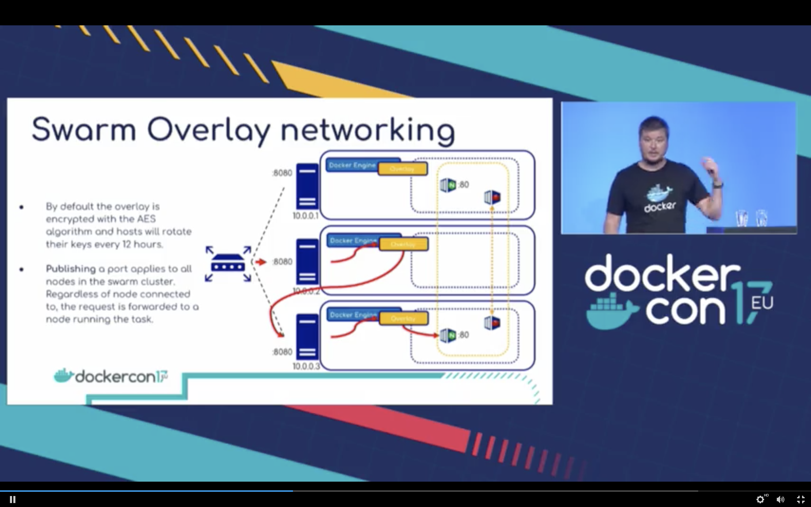
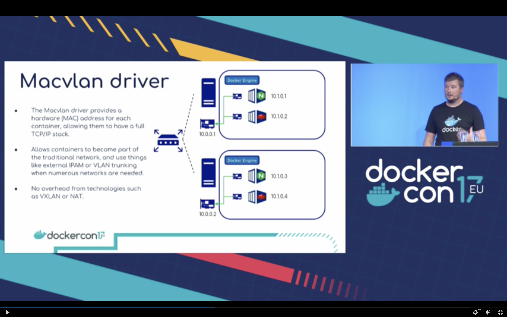
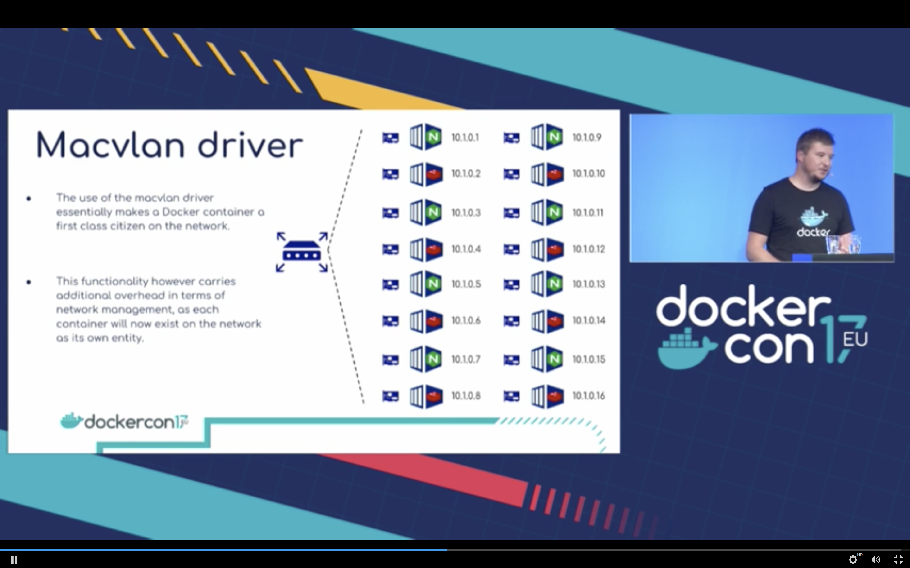
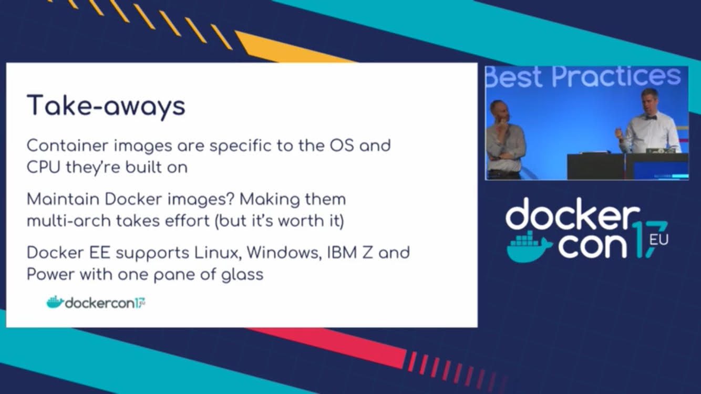
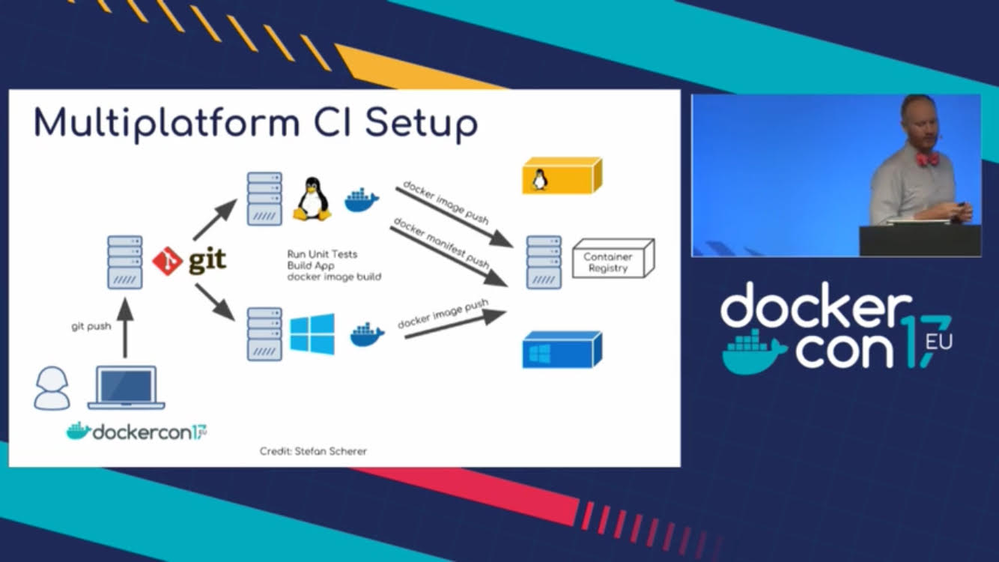

# Agenda

1. Alpine Linux  
1. Docker in Docker
1. Docker networking
1. Docker multi-stage builds
1. Multi-architecture Docker images

**Out of scope:**

* Docker basics, `cgroups`/`namespaces` kontra `hypervisor` eller grundläggande tooling...
* Container orkestrerare (Swarm, Kubernetes, Mesos, AWS ECS.  
  ett teknikområde värt sitt eget kompetensmöte...

# Alpine Linux

Tekniska egenskaper som gjort Alpine Linux så populär som Docker bas image.

[DockerCon EU 2017 presentation - Alpine Linux](https://dockercon.docker.com/watch/6nK1TVGjuTpFfnZNKEjCEr)

Alpine's skapare, Natanael Copa ([som numer jobbar för Docker](https://news.ycombinator.com/item?id=1100082)), berättade om vad som ligger bakom Alpine's ledord "*Small, Simple, Secure*". Bland annat berättade Natanael om:

1. Alpine Linux > 10 år, dvs äldre än Dockler. Började med fokus på inbäddade device...

1. [musl clib](https://www.musl-libc.org), ett kompaktare och en mer korrekt C/POSIX standard library implementation än den traditionella [glibc](http://www.gnu.org/software/libc/) som följer med de flesta Linux distributioner i dagsläget.

1. [BusyBox](https://busybox.net/about.html), en kompakt binär som innehåller många av de vanligaste UNIX kommandona.   
BusyBox är ca 800kb stor, att t ex jämföras med bara bash-interpretatorn som gå loss på 700 kb...

1. [apk-tools](https://wiki.alpinelinux.org/wiki/Alpine_Linux_package_management), Alpines installationsverktyg som fokusera på snabbhet genom att bara läsa och skriva en gång under en isntallation. Traditionella installationsverktyg läser och skriver typiskt flera gånger till disk under upppackning och verifieringsfaser.

Docker imagen för Alpine ligger på ca 5mb medans traditionella bas imagar för t ex CentOS och Ubuntu är uppåt 180MB stora. Docker själva använder själva Alpine som bas image numer, se tex [Docker Official Images are Moving to Alpine Linux](https://www.brianchristner.io/docker-is-moving-to-alpine-linux/)

# Docker in Docker

**Use case:** CI tools, t ex Jenkins, som exekverar som Docker containrar. 

**Fråga:** Hur bygga och testa Docker images när Jenkins redan exekverar i en Docker container?

**Ide:** Låt en Docker container uppträda som en Docker Host (pss som en VM...), dvs exekvera Docker i containern. Då kan en container använda Docker tooling och CLI helt transparent.

**Mitt favorit Use case:** Hur testa en container orkestrerare, t ex Docker Swarm eller Kubernetes, lokalt (på en minnesbegränsad Mac...)?

En Master och tre Workers i VirtualBox med minimal minnestilldening, 2GB, per VM tar 8GB, inget bra...

Vad händer om man låter Docker for Mac vara Master node och som exekverar Worker noderna som containerar mha Docker in Docker?

## Setup

I ett fönster:

	# Monitor Master and Worker nodes
	ctop

I ett annat fönster:

	# Docker version
	DOCKER_VERSION=17.06.2-ce-dind

	# Number of workers
	NUM_WORKERS=6

	# Init Swarm master
	docker swarm init

	# Get join token:
	SWARM_TOKEN=$(docker swarm join-token -q worker)
	echo $SWARM_TOKEN
    
	# Get Swarm master IP (Docker for Mac xhyve VM IP)
	SWARM_MASTER=$(docker info | grep -w 'Node Address' | awk '{print $3}')
	echo $SWARM_MASTER
	
	# Run NUM_WORKERS workers with SWARM_TOKEN
	for i in $(seq "${NUM_WORKERS}"); do
		docker run -d --privileged --name worker-${i} --hostname=worker-${i} -p ${i}2375:2375 docker:${DOCKER_VERSION}
		docker --host=localhost:${i}2375 swarm join --token ${SWARM_TOKEN} ${SWARM_MASTER}:2377
	done

	# Setup the vizualiser
	docker service create \
	  --detach=true \
	  --name=viz \
	  --publish=8000:8080/tcp \
	  --constraint=node.role==manager \
	  --mount=type=bind,src=/var/run/docker.sock,dst=/var/run/docker.sock \
	  dockersamples/visualizer

## View

	docker node ls
	docker service ls

Open Vizualiser: [localhost:8000]()

## Deploy and scale

	docker service create --name quotes-service --detach=true -p 8080:8080 magnuslarsson/quotes:go-22
	docker service scale quotes-service=20  --detach=true

Verify:

	for i in $(seq "${NUM_WORKERS}"); do
		echo "Containers on worker-${i}:"	
		docker exec -it worker-${i} docker ps
	done

## Try out

	curl localhost:8080/api/quote -s -w "\n" | jq .
	# {
	#   "ipAddress": "fc9193f817ef/",
	#   "quote": "If I had to describe Go with one word it’d be ‘sensible’.",
	#   "language": "EN"
	# }

	# Loop...
	while true; do o="$(curl localhost:8080/api/quote -s -w "\n" | jq -r .ipAddress)"; clear; echo "$o"; sleep 1; done

## ??? Setup DOCKER - env vars ???

Hur gör man samma för DIND Docker engines???

	$ docker-machine env
	export DOCKER_TLS_VERIFY="1"
	export DOCKER_HOST="tcp://192.168.99.100:2376"
	export DOCKER_CERT_PATH="/Users/magnus/.docker/machine/machines/default"
	export DOCKER_MACHINE_NAME="default"
	# Run this command to configure your shell:
	# eval $(docker-machine env)

## Teardown

	# Remove services
	docker service rm quotes-service
	
	# unregister worker nodes
	# for all workers: "docker exec -it 2c199cdabb15 docker swarm leave"
	
	# Remove worker nodes
	docker rm -f $(docker ps -a -q --filter ancestor=docker:${DOCKER_VERSION} --format="{{.ID}}")		
	# Remove the vizualiser
	docker service rm viz

	# Leave Swarm mode:    
    docker swarm leave --force

# Docker Networking

[//]: # (Bygger på standardkomponenter för nätverk i Linux, t ex:)
[//]: # ( )
[//]: # (* VIP)
[//]: # (* VLAN)
[//]: # (* Bridge Network)
[//]: # (* VXLAN)
[//]: # (* IPAM)
[//]: # ( )
[//]: # (## The rest...)

[DockerCon EU 2017 presentation - Practical Design Patterns in Docker Networking](https://dockercon.docker.com/watch/zjBnp41ef6McifwWT3yDuR)

[DockerCon EU 2017 presentation - Deeper Dive in Docker Overlay Networks](https://dockercon.docker.com/watch/XkRRA7Etsznv7uAk1UKsri)

[//]: # (För egen del gick jag på många föredrag som handlade om hur man sätter upp olika typer av mjukvarudefinierade nätverk [SDN](https://en.wikipedia.org/wiki/Software-defined_networking) i Docker.)

Docker har en plugin modell för olika typer av nätverk enligt principen [*batteries included but removable*](https://twitter.com/solomonstre/status/530537767122784256). Dels finns det ett antal inbygda nätverkstyper *Null, Host, Bridge, Overlay* och *Macvlan* men också ett antal tredje parts alternativ så som [Weave](https://www.weave.works/docs/net/latest/overview/) och [Calio](https://www.projectcalico.org). 

Docker egna nätverkstyper helt och hållet bygger på befintliga mekanismer i Linux, för den nyfikne kan jag rekommendera följande [blog post](http://blog.mbrt.it/2017-10-01-demystifying-container-networking/) som beskriver hur man sätter upp ett motsvarande *overlay* nätverk med rena Linux kommandon :-)

För en introduktion till de olika typerna av nätverk som finns för Docker (inbygda och tredje parts) så kan jag rekommendera förljande artikel: [Docker Reference Architecture: Designing Scalable, Portable Docker Container Networks](https://success.docker.com/article/Docker_Reference_Architecture-_Designing_Scalable,_Portable_Docker_Container_Networks).

## Null network

E.g. used for IoT device that don't need any networking...

## Host network

Share network with the host, IP address, ports...

Won't work (port collisions):

	docker run --rm --net=host --name nginx-1 nginx
	docker run --rm --net=host --name nginx-2 nginx
	# nginx: [emerg] bind() to 0.0.0.0:80 failed (98: Address already in use)

Login to host and try out access to nginx-1

	xhyve-vm
	curl localhost
	ctrl/A + k

## Bridge network

The ***default*** network. Isolerat single host only nätverk.   
Alla containrar anslutna till nwätverket kan prata med varandra men ingen utanför kan nå in i nätverket. 

Switchen `-p` måste användas för att forwarda portar från hosten in till containrar i nätverket...

> "***Docker for Mac***" forwardar porten hela vägen från MAc'en och inte bara från Docker Host'en

Will work:

	docker run --rm -p80:80 --name nginx-1 nginx
	docker run --rm -p81:80 --name nginx-2 nginx

	docker ps | grep nginx
	
	curl localhost
	curl localhost:81
	

## Overlay

Demo:

1. Create a overlay network

		docker network create -d overlay my-network

1. Jump into one of the nodes, `worker-1`, and start a nginx container and connect it to the overlay networ

		docker exec -it worker-1 docker run --rm --network=my-network --name nginx-1 nginx		

	From another terminal:

		docker exec worker-1 docker network inspect my-network

1. Jump into another node, `worker-3`, and access the nginx server over the overlay network   
   Without specifyting the network:

		docker exec -it worker-3 docker run --rm --network=my-network alpine wget -O - http://nginx-1

## Macvlan

Ger varje container  en MAC Address så att det kan anslutas direkt till ett fysiskt nätverk, som en "first class citizen".
Kan därmed övervarkas av t ex IPAM mjukvara (IP address management).

# MultiStage builds

**Challange:** How to eliminate setup of develompent tools on each developes PC and in CI environments et al?

**Constraints:** No issue with only `Maven/Gradle + Java`, but when adding `JavaScript`, `Node`, `MS .Net`, `Go`, `Swift` et al its getting more and more complex and error prune to keep all dev envs and CI's in sync... 

**Idea:** Can't we use containers to run our tools in the same way as they already run our applications?

**Attempt 1:** Build artifacts in one **big** Docker image including dev tools and runtim:

	FROM maven:3.5-jdk-8
	
	COPY src /usr/src/myapp/src
	COPY pom.xml /usr/src/myapp
	RUN mvn -f /usr/src/myapp/pom.xml clean package
	
	ENV WILDFLY_VERSION 10.1.0.Final
	ENV WILDFLY_HOME /usr
	
	RUN cd $WILDFLY_HOME && curl http://download.jboss.org/wildfly/$WILDFLY_VERSION/wildfly-$WILDFLY_VERSION.tar.gz | tar zx && mv $WILDFLY_HOME/wildfly-$WILDFLY_VERSION $WILDFLY_HOME/wildfly
	
	RUN cp /usr/src/myapp/target/people-1.0-SNAPSHOT.war $WILDFLY_HOME/wildfly/standalone/deployments/people.war
	
	EXPOSE 8080
	
	CMD ["/usr/wildfly/bin/standalone.sh", "-b", "0.0.0.0"]

Cause looong build times and results in big big Docker images with a lot of security issues (a lot of dev tools in production...), no great solution...

...**[multi-stage builds](https://docs.docker.com/engine/userguide/eng-image/multistage-build/)** was introduced in Docker 17.05!

**Attempt 2:** Naive usage of multi-stage builds with Java...

	FROM maven:3.5-jdk-8 as BUILD
	
	COPY src /usr/src/myapp/src
	COPY pom.xml /usr/src/myapp
	RUN mvn -f /usr/src/myapp/pom.xml clean package
	
	FROM jboss/wildfly:10.1.0.Final
	
	COPY --from=BUILD /usr/src/myapp/target/people-1.0-SNAPSHOT.war /opt/jboss/wildfly/standalone/deployments/people.war

> **Downside:** downloads all dependencies on every code change :-(

**Attempt 3:** Introduce a local Nexus repo to minimize the download time!

Start a local Nexus repo using Docker:

	docker run -d -p 8081:8081 --name nexus -v ~/Documents/projects/nexus-data:/nexus-data sonatype/nexus3

Dockerfile:

	FROM maven:3.5-jdk-8 as BUILD
	
	COPY settings.xml /root/.m2/settings.xml
	
	COPY src /usr/src/myapp/src
	COPY pom.xml /usr/src/myapp
	RUN mvn -f /usr/src/myapp/pom.xml clean package
	
	FROM jboss/wildfly:10.1.0.Final
	
	COPY --from=BUILD /usr/src/myapp/target/people-1.0-SNAPSHOT.war /opt/jboss/wildfly/standalone/deployments/people.war
	
> **Downside:** works but downloads from local nexus repo still takes a lot of time
	
**Attempt 4:** Use Docker image chaching by perform a `mvn dependency:go-offline` before copying the source code:

	FROM maven:3.5-jdk-8 as BUILD
	# /root/.m2 is a volume :(
	ENV MAVEN_OPTS=-Dmaven.repo.local=../m2repo/
	
	COPY pom.xml /usr/src/myapp/pom.xml
	RUN mvn -f /usr/src/myapp/pom.xml -B -e -C -T 1C org.apache.maven.plugins:maven-dependency-plugin:3.0.2:go-offline
	
	COPY src /usr/src/myapp/src
	RUN mvn -f /usr/src/myapp/pom.xml -B -e -o -T 1C verify
	
	FROM jboss/wildfly:10.1.0.Final
	COPY --from=BUILD /usr/src/myapp/target/people-1.0-SNAPSHOT.war /opt/jboss/wildfly/standalone/deployments/people.wardocker-java-multis

> ...works fine with **one minor catch**, if one dependency is changed the Docker image cache gets invalidated and the whole repo is downlaoded again...

## Details on local Nexus in Docker

Startup:

	mkdir ~/Documents/projects/nexus-data && chmod 777 ~/Documents/projects/nexus-data
	docker run -d -p 8081:8081 --name nexus -v ~/Documents/projects/nexus-data:/nexus-data sonatype/nexus3
	docker logs -f nexus

Test:

	curl -u admin:admin123 http://localhost:8081/service/metrics/ping
	# pong
	
From a container:

	docker run -it --rm centos curl -u admin:admin123 http://Magnuss-MBP.lan:8081/service/metrics/ping	# pong

Web: [http://localhost:8081]() (admin/admin123)

Maven-central proxy URL: [http://localhost:8081/repository/maven-central/]()

`~/.m2/settings.xml`:
	
	<?xml version="1.0" encoding="UTF-8"?>
	<settings xmlns="http://maven.apache.org/SETTINGS/1.1.0"
	  xmlns:xsi="http://www.w3.org/2001/XMLSchema-instance"
	  xsi:schemaLocation="http://maven.apache.org/SETTINGS/1.1.0 http://maven.apache.org/xsd/settings-1.1.0.xsd">
	
	  <servers>
	    <server>
	      <id>nexus-snapshots</id>
	      <username>admin</username>
	      <password>admin123</password>
	    </server>
	    <server>
	      <id>nexus-releases</id>
	      <username>admin</username>
	      <password>admin123</password>
	    </server>
	  </servers>
	
	  <mirrors>
	    <mirror>
	      <id>central</id>
	      <name>central</name>
	      <url>http://localhost:8081/repository/maven-central/</url>
	      <mirrorOf>*</mirrorOf>
	    </mirror>
	  </mirrors>
	
	</settings>

Add to projects `pom.xml`:

	  <repositories>
	    <repository>
	      <id>maven-central</id>
	      <url>http://localhost:8081/repository/maven-central/</url>
	    </repository>
	  </repositories>
	  
## Local build

With Nexus running:

	$ time mvn compile
	real	0m8.373s

## Build and run

	docker image build -f Dockerfile -t people:multistage .
	docker container run -it --rm -p 8080:8080 --name wildfly people:multistage
	curl http://localhost:8080/people/resources/persons
	
	
# Multi-architecture Docker images

To build docker images that support multiple architectures use the upcoming `docker manifest` command. Until `docker manifest` gets GA, use [https://github.com/estesp/manifest-tool]()...

	$ docker run mplatform/mquery golang
	Image: golang
	 * Manifest List: Yes
	 * Supported platforms:
	   - linux/amd64
	   - linux/arm/v7
	   - linux/arm64/v8
	   - linux/386
	   - linux/ppc64le
	   - linux/s390x
	   - windows/amd64:10.0.14393.1884
	   - windows/amd64:10.0.16299.64	
	
	   
	$ docker run mplatform/mquery openjdk
	Image: openjdk
	 * Manifest List: Yes
	 * Supported platforms:
	   - linux/amd64
	   - linux/arm/v5
	   - linux/arm/v7
	   - linux/arm64/v8
	   - linux/386
	   - linux/ppc64le
	   - linux/s390x   

	$ docker run mplatform/mquery openjdk:nanoserver
	Image: openjdk:nanoserver
	 * Manifest List: Yes
	 * Supported platforms:
	   - windows/amd64:10.0.14393.1884
	   - windows/amd64:10.0.14393.1884

## Test med en Java app på Linux och Windows containrar

Dockerfil för Windows: `Dockerfile-Windows`:

	FROM openjdk:8u151-jdk-nanoserver-sac2016
	
	MAINTAINER Magnus Larsson <magnus.larsson.ml@gmail.com>
	
	EXPOSE 8080
	
	ADD ./build/libs/*.jar app.jar
	
	ENTRYPOINT ["java", "-jar","/app.jar"]

Bygg Docker image för Windows: 

	C:\> docker build -f .\Dockerfile-Windows . -t quotes

Starta Docker container på Windows:

	C:\> docker run --rm -p8080:8080 quotes

> **NOTE:** Access via `localhost` fungerar inte, t ex `curl http://localhost:8080/api/quote`.  
> Se: [https://blog.sixeyed.com/published-ports-on-windows-containers-dont-do-loopback/]()
>
> Måste gå via *hostens externa IP adress* eller *containerns egna IP adress*!
>
> Använd `ipconfig` för att hitta den externa IP addressen.

	C:\> curl http://192.168.1.224:8080/api/quote -UseBasicParsing

	StatusCode        : 200
	StatusDescription :
	Content           : {"ipAddress":"a6eaef79350b/172.23.245.241:8080","quote":"To be or not to be","language":"en"}
	RawContent        : HTTP/1.1 200
	                    X-Application-Context: quotes-service:8080
	                    Transfer-Encoding: chunked
	                    Content-Type: application/json;charset=UTF-8
	                    Date: Sat, 02 Dec 2017 12:17:58 GMT
	                    {"ipAddress":"a6eaef79350b/1...
	Forms             :
	Headers           : {[X-Application-Context, quotes-service:8080], [Transfer-Encoding, chunked], [Content-Type, application/json;charset=UTF-8], [Date,
	                     Sat, 02 Dec 2017 12:17:58 GMT]}
	Images            : {}
	InputFields       : {}
	Links             : {}
	ParsedHtml        :
	RawContentLength  : 93

> **NOTE:** Hur få tag på containerns interna IP adress på Windows???   
> Följande fungerar inte [https://forums.docker.com/t/cant-get-ip-of-windows-container-networksettings-missing/28772]()
>
> **Workaround:** Min tjänst skriver ut containerns IP adress, använd den för nu!

	C:\> curl http://172.23.245.241:8080/api/quote -UseBasicParsing
	
	StatusCode        : 200
	StatusDescription :
	Content           : {"ipAddress":"a6eaef79350b/172.23.245.241:8080","quote":"You, too, Brutus?","language":"en"}
	RawContent        : HTTP/1.1 200
	                    X-Application-Context: quotes-service:8080
	                    Transfer-Encoding: chunked
	                    Content-Type: application/json;charset=UTF-8
	                    Date: Sat, 02 Dec 2017 12:24:28 GMT
	                    {"ipAddress":"a6eaef79350b/1...
	Forms             :
	Headers           : {[X-Application-Context, quotes-service:8080], [Transfer-Encoding, chunked], [Content-Type, application/json;charset=UTF-8], [Date,
	                     Sat, 02 Dec 2017 12:24:28 GMT]}
	Images            : {}
	InputFields       : {}
	Links             : {}
	ParsedHtml        :
	RawContentLength  : 92
